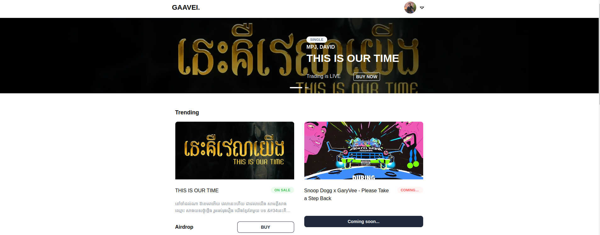

 
 ## Gaavei
 ### Introduction

 Gaavei (Mean Love in Greek and Author in Cambodia) is a music co-ownership platform for web3 collectives to pool resources and own share revenue together through NFTs.

Gaavei enable artists to forge a more direct relationship with their collector community. By helping to circumvent larger platforms, music NFTs give artists the chance to build a more direct connection with their fan base, who can also benefit from new ways of interaction and ownership.

### Problem

Currently, many artists find it difficult to see significant returns on streaming platforms. According to [some estimates](https://soundcamps.com/spotify-royalties-calculator/), one stream on Spotify amounts to about $0.004 paid to the artist, meaning that one million streams net roughly $4000. Getting that many streams isn’t realistic for most independent artists. The opportunities for musicians to earn an income have significantly decreased.  It’s important to note that the issue here isn’t necessarily with individual companies but more with the underlying economic model.

### Solution 

Gaavei turn pieces of music into a commodity, like a piece of art that can be bought and sold, similar to the earlier days of the music industry with vinyl records, cassette tapes, CDs as well as MP3s.

The artist doesn’t have to change they way they work, They still producing their music and upload to those steaming provider, by the end quarter they will share the revenue to their early fan who invest in their music but more freedom. 

This way the artists will not rely on record labels (ultimately a for-profit business) for investment as well ask the sponsor like alcohol company which is have a huge influence in Cambodia.

### How does it work?

For artist who want to be our partner we need you to connect all your steaming provider in our platform. This will allow our forecast service to provide the estimate of the revenue to their fan and collector. 

Artist are freely add on their reward to their fans like mechanized or concert ticket or meet and greed to build their drop more engagement. 

Upload the demo or complete song to the platform and Gaavei will help promote and share the information across the community. 

After the end of NFT sell event finish artist can withdraw the money to make their finial version. Every time their NFT trade in a secondary market place artist will earn the royalty fee from this trade.

### For Artist:

- Sign up and Connect Wallet
- Apply for creator with social link and Streaming provider like YouTube, Sportify and Apple Music ,etc.
- Accept terms and condition at Gaavei.
- Start sharing or dropping albums.

### For collector

No Signing up is require just Connect  wallet and login with existing google account (next version will be able to login from any social account)

- Complete profile by Link to social ,etc.
- Deposit (BUSD, ETH, BNB, etc)
- Select favorite song or albums and purchase.
- Receive NFT 
- Hold to claim royalty: The artist will post the revenue quarterly about the income from streaming platform like YouTube, Sportify and Apple Music and we will inform when you are ready to claim the royalty.
- You can trade in secondary market like Opensea, Blur, LooksRare, and X2Y2 as well as specialized Web3-native platforms such as Audius, Sound XYZ, Royal, Opulous, and Catalog.

### Why artist should join Gaavei?
Every artist joining our platform will get a free portfolio web-page, social media security checklist links to various designer, videographer, studio and access to wider community range.

### Major Features

- Music Ownership On-Chain (live)
- Film Ownership Tokenization (coming soon)
- Festival & Charity Tickets On-Chain (coming soon)

### WIN TOGETHER

Gaavei open opportunities for Solo, Group of independent artist, and communities by making access to emerging blockchain products and new sharing economy. We bringing the blockchain evolution  the masses together with the industry creators and collectors.

### Built with LOVE

Our mission at Gaavei is to build the frameworks, protocols, and experiences that make co-ownership more accessible from individual level. With Gaavie allow web3 collectives pooling resource together to reshape the culture, capital, and commerce.

Join us on this exciting adventure that redefines communities and ownership!
